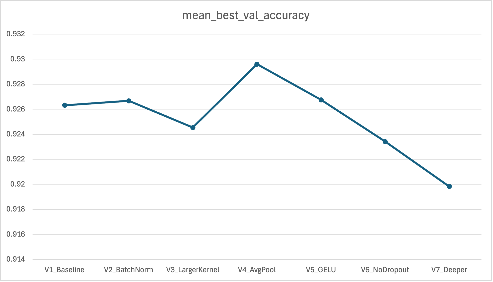
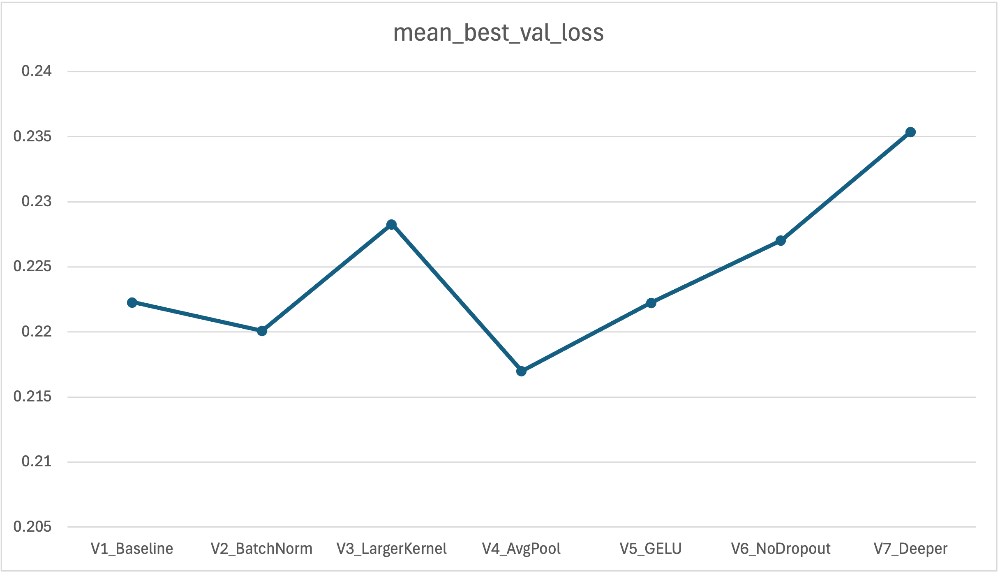

## Python Version

`3.10` or you can try on your current version first. \
For packages, install any required dependencies as needed for the tasks. There should not be any major compatibility issues.

## Validation ratio i used

`0.2`

---

# CNN Part

The Jupyter notebook for the CNN is:

`src/fashion_mnist_cnn_manual_kfold.ipynb`

This is the latest version of the CNN training notebook. Please ignore versions `v0`, `v1`, and `v2`.

I have seven versions of the CNN model:

```python
model_configs = {
    "V1_Baseline": {
        "conv_channels": [32, 64],
        "kernel_size": 3,
        "pool_type": "max",
        "activation": "relu",
        "dropout": 0.3,
        "use_batchnorm": False
    },
    "V2_BatchNorm": {
        "conv_channels": [32, 64],
        "kernel_size": 3,
        "pool_type": "max",
        "activation": "relu",
        "dropout": 0.3,
        "use_batchnorm": True
    },
    "V3_LargerKernel": {
        "conv_channels": [32, 64],
        "kernel_size": 5,
        "pool_type": "max",
        "activation": "relu",
        "dropout": 0.3,
        "use_batchnorm": False
    },
    "V4_AvgPool": {
        "conv_channels": [32, 64],
        "kernel_size": 3,
        "pool_type": "avg",
        "activation": "relu",
        "dropout": 0.3,
        "use_batchnorm": False
    },
    "V5_GELU": {
        "conv_channels": [32, 64],
        "kernel_size": 3,
        "pool_type": "max",
        "activation": "gelu",
        "dropout": 0.3,
        "use_batchnorm": False
    },
    "V6_NoDropout": {
        "conv_channels": [32, 64],
        "kernel_size": 3,
        "pool_type": "max",
        "activation": "relu",
        "dropout": 0.0,
        "use_batchnorm": False
    },
    "V7_Deeper": {
        "conv_channels": [16, 32, 64],
        "kernel_size": 3,
        "pool_type": "max",
        "activation": "relu",
        "dropout": 0.3,
        "use_batchnorm": True
    }
}
```

The training summary results are stored in:

`src/results_kfold/model_comparison_cv_summary_by_loss.csv`

We sorted the models by **best validation accuracy (descending)** and **best validation loss (ascending)**. Based on the mean performance across all folds, **V4_AvgPool** ranks first under both criteria.

One possible explanation is the difference between max pooling and average pooling. Max pooling emphasizes the strongest local features, while average pooling preserves a smoother and more general representation of the region. Since Fashion-MNIST classification depends heavily on the overall shape and structure of clothing items, average pooling may work better for this task. (This is my current hypothesis.)

The file

`src/results_kfold/all_model_training_log.csv`

contains the training results before taking the mean across folds.

## Test dataset result

The test evaluation notebook is:

`src/load_model_and_evaluate_on_test_set.ipynb`

To test a trained model, go to the seventh cell and edit:

```python
Version = 4
fold = 4
model_config = {
    "conv_channels": [32, 64],
    "kernel_size": 3,
    "pool_type": "avg",
    "activation": "relu",
    "dropout": 0.3,
    "use_batchnorm": False
}
model_path = f"saved_models_kfold/V{Version}_AvgPool_fold{fold}_best_loss.pth"
```

Change this to the version and fold you want to evaluate, and copy the corresponding CNN architecture from the model configurations above. Also modify the model path if you want to use `best_acc` instead of `best_loss`.

The notebook will output:

* test accuracy
* test loss
* precision, recall, and F1-score for each category
* confusion matrix

Interestingly, for almost all models, **fold 3** gives the best performance. This may be related to how the dataset was shuffled and split, which could have produced a slightly more favorable validation distribution. This is our current guess.

---

# Transformer Part

The Jupyter notebook for the Vision Transformer (ViT) is:

`src/transformers/fashion_mnist_vit_v3.ipynb`

This is the latest version of the ViT training notebook. Please ignore versions `v0`, `v1`, and `v2`.

I have three versions of the model, where only the hyperparameters were changed.

## transformer_v1 hyperparameters

* `EMBED_DIM = 64`
* `NUM_HEADS = 4`
* `NUM_LAYERS = 4`
* `MLP_DIM = 128`

## transformer_v2 hyperparameters

* `EMBED_DIM = 32`  ← reduced from 64
* `NUM_HEADS = 2`   ← reduced from 4
* `NUM_LAYERS = 2`  ← reduced from 4
* `MLP_DIM = 64`    ← reduced from 128

## transformer_v3 hyperparameters

* `EMBED_DIM = 128` ← increased from 64
* `NUM_HEADS = 8`   ← increased from 4
* `NUM_LAYERS = 6`  ← increased from 4
* `MLP_DIM = 256`   ← increased from 128

## Training results

The training results are stored in:

`src/transformers/results_kfold`

* Files with the suffix `cv_summary.csv` contain the mean cross-validation results (`k=5`).
* Files with the suffix `training_log.csv` contain the detailed training logs, including training accuracy/loss and validation accuracy/loss for every epoch in every fold.

## Message for the person doing the evaluation

In `fashion_mnist_vit_test_eval.ipynb`, if you want to test any trained model, simply change:

`CHECKPOINT_PATH = "transformers/saved_models_kfold/transformer_v1_fold1_best_loss.pth"`

Here, `best_loss` refers to the checkpoint with the **lowest validation loss** in that fold over 100 epochs.

Similarly, `best_acc` refers to the checkpoint with the **highest validation accuracy** in that fold over 100 epochs.

Then click **Run All**. The notebook will output:

* test accuracy
* test loss
* precision, recall, and F1-score for each category
* confusion matrix

## Message for the person doing the write-up

We try on ViT because we wanted to explore a modern deep learning architecture beyond standard CNNs. ViT is interesting because it processes images in a way that is similar to how transformers process words in a sentence. Instead of focusing only on local neighboring pixels, it can learn relationships between different image regions through self-attention.

For Fashion-MNIST, this is useful because clothing categories are often distinguished by their overall shape and structure. Our architecture consists of patch embedding, positional encoding, a class token, several transformer encoder blocks, and a final classification layer.

We used a compact configuration with embedding dimension 64, 4 attention heads, 4 transformer layers, and MLP dimension 128 so that the model remains efficient and suitable for this dataset.

**But** I still not sure which model(CNN or ViT) is better, my guess is for small dataset, CNN might be slightly better. But if the dataset is big enough, ViT will catch up the performance. 

---

# Analysis
For my individual component, I focused on deep learning methods, specifically Convolutional Neural Networks (CNNs) and Vision Transformers (ViTs), for Fashion-MNIST classification.

For the CNN part, I developed and tested seven model variants by modifying key architec-tural choices such as kernel size, pooling type, and activation function. One challenge was that several variants achieved very similar performance, making it difficult to determine whether the differences were due to actual architectural improvements or randomness in the data split. To address this, I relied on mean cross-validation performance across folds in- stead of judging models based on a single run. Based on the training summary, V4 AvgPool achieved the best overall validation accuracy and validation loss, suggesting that average pooling may preserve the overall shape of clothing items better than max pooling for this
dataset. However, the performance gap between models was small, so this remains a tentative conclusion rather than a final one. I also noticed that Fold 3 often produced the strongest results across models, even with a fixed random seed, which may indicate that this fold happened to have a slightly more favorable validation distribution.

## Plots for CNN model




For the transformer part, I implemented three Vision Transformer variants with different
embedding dimensions, numbers of attention heads, encoder layers, and MLP dimensions. I
first built a compact baseline model and then created smaller and larger variants by changing only a few hyperparameters, allowing for a clearer comparison of model scale.

## Performance Results

| Model | Configuration | Mean Best Validation Accuracy (%) | Mean Best Validation Loss | Key Observation |
| :--- | :--- | :--- | :--- | :--- |
| **Transformer_v1** | EMBED_DIM=64, <br>NUM_HEADS=4, <br>NUM_LAYERS=4, <br>MLP_DIM=128 | 90.4749 | 0.2793 | Lowest validation loss |
| **Transformer_v2** | EMBED_DIM=32, <br>NUM_HEADS=2, <br>NUM_LAYERS=2, <br>MLP_DIM=64 | 88.6017 | 0.3111 | Lowest-performing configuration |
| **Transformer_v3** | EMBED_DIM=128, <br>NUM_HEADS=8, <br>NUM_LAYERS=6, <br>MLP_DIM=256 | 90.5283 | 0.2884 | Highest validation accuracy |

> Comparison of Vision Transformer variants on Fashion-MNIST.

At this stage, my interpretation is that CNNs are likely more suitable for a relatively small dataset such as Fashion-MNIST, since convolutional layers have a stronger built-in inductive bias for local patterns, while ViTs are typically more competitive when trained or pretrained on much larger datasets. Overall, my individual contribution provides a structured comparison between CNN-based and transformer-based approaches. The CNN models currently show the strongest and most consistent performance, with V4 AvgPool emerging as the best-performing CNN variant based on cross-validation. The transformer models are still under evaluation, and final conclusions will depend on the held-out test set results. Moving forward, I will combine the cross-validation findings with test accuracy, test loss, per-class precision, recall, F1-score, and confusion matrices so that the final report can present both overall model comparison and class-level error patterns clearly.

---
Written by `Chung Jia Cheng`

